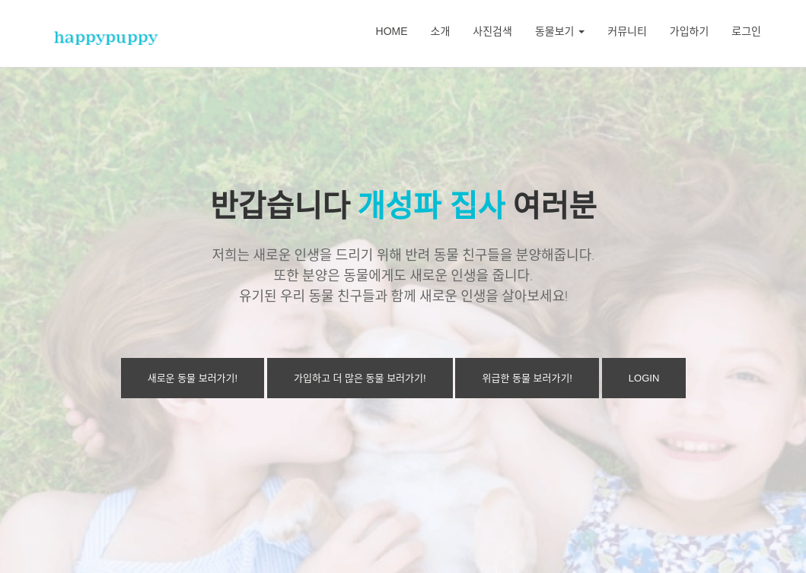
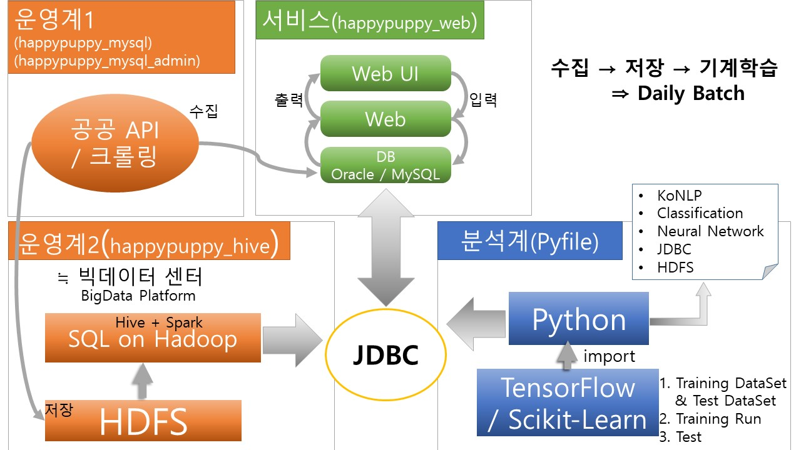

# HappyPuppy  

  
  
#### 1.프로젝트 개요
- 반려견 인구 1000만 시대 
- 동시에 급증하는 유기견 수 
- 유기견은 공고일 이후 반환 또는 입양되지 않으면 안락사 됨
- 안락사 되는 동물을 줄이기 위해 프로젝트 기획

#### 2.프로젝트 특징
- 발견 당시 특징을 통해 공고 종료시 결과 데이터를 저장(공공데이터 REST API, HDFS)
- 기계학습을 통해 새로운 유기견 데이터의 공고 종료에 대한 결과를 예측(DNN 멀티 레이어)
- 안락사 예측율이 높은 공고에 대해서는 상단에 위치하여 추천
- 스케줄러를 통해 매일 새로운 데이터 저장
  
    

#### 3.개발 환경
- 개발서버  
  - OS : Windows10 pro
  - Language : Python3.5, HTML5, CSS3, Javascript, Java8
  - DB : MySQL5.7
  - Web Server : Tomcat8.5
  - Framework : JSP MVC2
- 하둡서버(4대)  
  - OS : centos7
  - Language : Python3.5, Java8
  - DB : MySQL5.7
  - Framework : TensorFlow1.12, Hadoop3.1.4, Hive3.1.2
- 배포서버  
  - OS : AWS Ubuntu16
  - Language : Python3.5, HTML5, CSS3, Javascript, Java8
  - DB : MySQL5.7
  - Web Server : Tomcat8.5
  - Framework : JSP MVC2, TensorFlow1.12, Hadoop 3.1.4

#### 4.프로젝트 설계

* 운영계1([happypuppy_mysql](https://github.com/BongsoonChoi/happypuppy_mysql/tree/master), [happypuppy_mysql_admin](https://github.com/BongsoonChoi/happypuppy_mysql_admin/tree/master))   
: 통계 페이지에 통계 수치를 보여주기 위해 mysql에서 데이터를 가져오는 프로젝트. jar 파일로 배포  
: 관리자 페이지에서 보여줄 통계 데이터를 저장하고 조회하기위해 만든 프로젝트. jar 파일로 배포  
* 운영계2([happypuppy_hive](https://github.com/BongsoonChoi/happypuppy_hive/tree/master))  
: REST API에서 받아온 데이터를 hadoop에 저장하기 위한 배치용 프로젝트. jar 파일로 배포
* 분석계([pyfile](https://github.com/BongsoonChoi/HappyPuppy/tree/master/pyfile), [dump](https://github.com/BongsoonChoi/HappyPuppy/tree/master/dump))    
: 기계학습에 사용된 py파일 및 하이브와 python, mysql과 python 연결을 위한 라이브러리등이 담김.  
: CNN 학습 모델의 학습결과를 dump파일로 저장해둠.
* 서비스([happypuppy_web](https://github.com/BongsoonChoi/happypuppy_web/tree/master))    
: 웹 서비스에 대한 프로젝트.  war파일로 만들어 웹서버에 배포

#### 5.느낀점
- 처음으로 4개월간 이렇게 큰 프로젝트를 해보게 되어 프로젝트 관리와 업무분담의 중요성을 깨달음
- 적어도 4-5개의 프로젝트를 합치는 과정을 겪어야 하다보니 프로젝트 설계에 대한 고민을 많이 하게 되면서 개발 뿐만이 아니라 설계에 대한 생각을 많이 넓힐수 있었음  
- 개발에 있어서 서버 설계도 잘 되어야 하지만 인공지능에 대한 지식도 있어야 머신러닝 파이프라인을 구성할 수 있겠다는 생각이 들어 빅데이터와 머신러닝에 굉장한 흥미를 느끼게 되었고 데이터 엔지니어링에도 많은 관심을 갖게 되었음

#### 6.문제점
- 프로젝트 주제 선정에 대한 팀원 간 갈등  
->회식과 적극적인 대화를 통해 하나의 주제로 통일함.
- 공공API에서 받아온 데이터 중에 발견 당시 특징을 상세하게 기록하지 않은 지역이 많아 학습에 어려움을 겪음  
->서울, 경기도 지역에 한정된 서비스
- 개발환경과 서비스 환경의 불일치로 라이브러리에서 경로에 대한 에러 발생.  
->개발과 운영시 경로를 다르게 선언해줘야 했음. 추후 가능하다면 도커를 사용해 볼 예정.
- 사용자가 분실한 반려견의 사진을 올려 비슷한 종류의 유기견이 있는지 검색하는 서비스를 구성하던 중 트레이닝 데이터의 부족과 하드웨어 성능의 미달로 CNN 모델 예측의 부정확성  
-> 데이터 수집의 한계로 베타 서비스로만 그침.

hadoop server에 대한 도커 도입